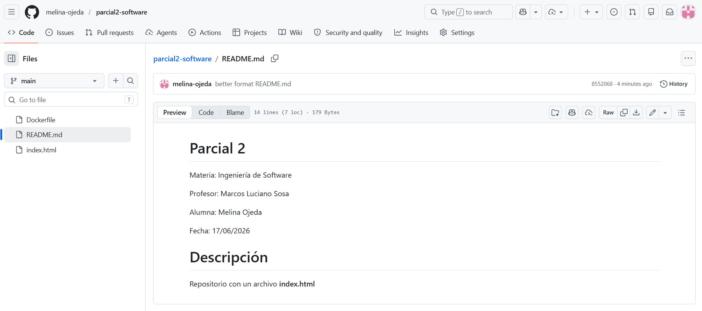
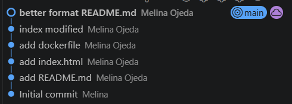
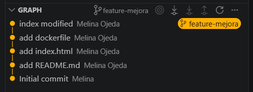
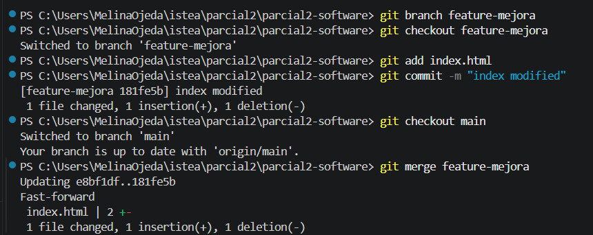
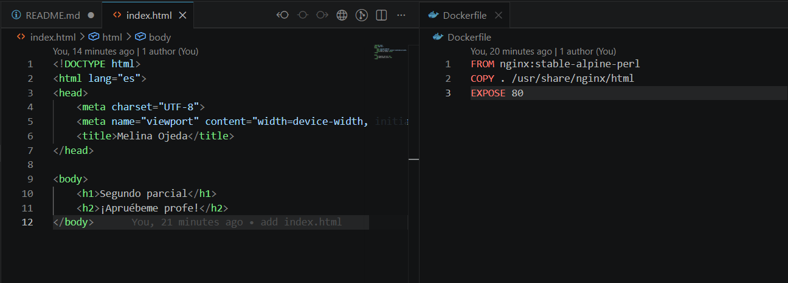
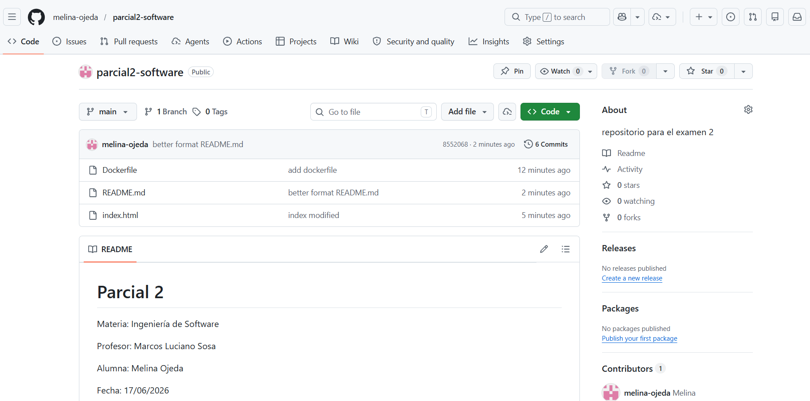

# Parcial 2

Materia: Ingeniería de Software

Profesor: Marcos Luciano Sosa

Alumna: Melina Ojeda

Fecha: 17/06/2026

# Descripción

Repositorio con un archivo **index.html** 

# Capturas de pantalla

2. Contenido del README.md

3. Historial de commits

4. Branch feature-mejora

5. Merge realizado

6. Archivos

7. Repositorio en GitHub
